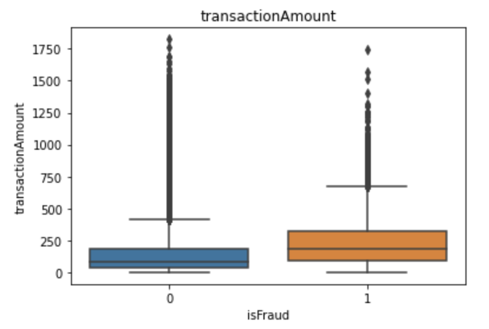
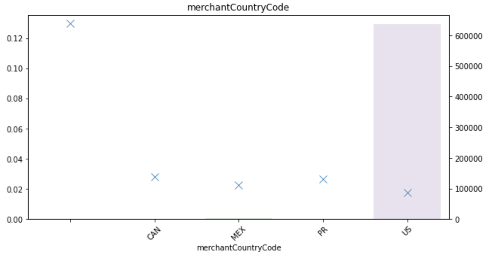
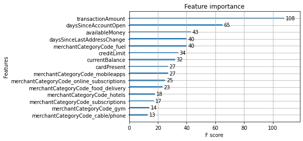
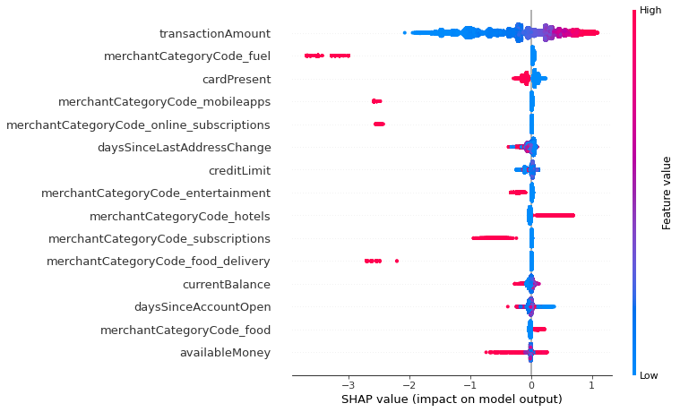

# Task

Use credit card transactions data to detect fraud

---

Notebooks:

* 01_exploratory_data_analysis.ipynb - contains data analysis to explore and understand the data set
* 02_feature_engineering.ipynb - contains steps to create and edit features
* 03_modelling.ipynb - contains fitting, tuning and evaluation of algorithms

---

# Data  

The original data set contained synthetic, line-delimited JSON relating to credit card transactions.

The data set contains ~640,000 transactions from the year 2016 with 29 columns, containing a mix of datetime, numeric and categorical features. The transactions are related to 5000 accounts.

The target column is `isFraud`. The data set is very imbalanced with only 1.76% being positive examples of fraudulent transactions.

Several columns were completely empty, so these were dropped. Some categorical columns did have missing values but these have not been filled in here. 

# Exploratory Data Analysis

To pull out a couple of interesting points:

The fraudulent transactions tend to have a higher transaction amount, so this could be a useful feature later.

The majority of data points are from US transactions. It may be useful for us to collect more transactions from other countries, if available. In addition, those transactions with missing merchant country code have a higher fraud rate, although the data is very small so this may not be significant. It would be useful to investigate this further.

# Feature Engineering

Several features were altered and several new features were created from the existing data, with some baked in assumptions (due to lack of data dictionary):

* Extracted time and day of week from the transaction timestamp column. There is a baked in assumption here that the transactions in the data set have taken place in the same timezone (although realistically this is probably not the case, based on the different country codes in the data!).
* A boolean to indicate whether the `cardCVV` matches the `enteredCVV`. This is based on the assumption that the `enteredCVV` is entered by the card user during a transaction.
* A grouping of less common `merchantName` entries into an `other` category. This leads to some information loss but also helps to avoid an extremely wide data frame, since it contains over 2000 unique values.

I also dropped several features for which I was lacking domain knowledge (e.g. `posEntryMode`).

# Oversampling

Due to the imbalance of the data (only 1.76% positive labels), a random oversampling technique was used to increase the presence of the positive labels in the training set to be 10% of the size of the negative labels. The change in the `isFraud` value counts is shown below:

Original training data

|label|count|
|---|---|
|0|441428|
|1|7911|

Oversampled training data

|label|count|
|---|---|
|0|441428|
|1|44142|

The data remains quite imbalanced but this should now allow the model to identify patterns in the fraudulent group more easily.

# Modelling

Due to the imbalance, I've chosen to use tree based models as these have built-in methods to help with addressing the imbalance.

The models will be assessed by viewing the ROC AUC score, as the imbalance means that using an accuracy score would not be useful. Alternative metrics that I could also consider include precision, recall and f1 score, however for sake of time and ease of comparison I have used ROC AUC only.

To give a benchmark performance to compare against, I fitted a Random Forest Classifier with the default sklearn parameters, except limiting the maximum depth to 6. This achieved a ROC AUC score of 0.71 with the most important feature being `transactionAmount` by far.

The next model I fitted was an XGBoost with default parameters and `scale_pos_weight=10` in order to encourage the model to "over-correct" for the positive labels. This achieved a ROC AUC score of 0.72 and again the most important feature was `transactionAmount`.

Finally, I ran a (very short) hyperparameter tuning job using Bayesian optimisation. The best model from this achieved a ROC AUC score of 0.73 with most important feature being `transactionAmount` again. The most important 15 features from this model are shown below:

Viewing the SHAP graph from the test data, it's interesting to see how exactly the features are interacting with the model predictions. For example, hotel transactions are given a higher probability of being fraudulent, as are transactions with higher transaction amounts, whilst fuel and mobile subscriptions are given lower probabilities (for example).

Running a longer hyperparameter tuning job would certainly improve the ROC AUC score, but including more features and developing the current features even further would probably improve it more significantly.

# Further Steps

* Investigate missing data from categorical columns. In some cases, the fact that the information is missing may be a useful feature. I would try to understand why the data is missing in the first place by discussing with engineers or checking the data export script.
* Discuss the features with business stakeholders to understand more about the current features, and discuss any additional features that they suggest to investigate.
* Explore the features that I had dropped due to lack of domain knowledge. Use these as features in a model to understand more about their predictive power.
* Explore alternative ways to deal with the high cardinality columns. For example, I have seen a suggested method online whereby the entries are replaced by the count of that particular entry. In the case of `merchantName` in particular, I might try to extract the main merchant name and drop (what I assume to be) the specific location ID, for example, there are entries for `Renaissance Hotel #583180` and `Renaissance Hotel #499336` which could be aggregated into a single entry for `Renaissance Hotel`. It may also be possible to extract the location from the ID.
* Explore whether increasing the size of the positive class even further (i.e. increasing the proportion during oversampling) could improve the performance of the model.
* Run a longer hyperparameter tuning job.
* Further evaluate the best model by viewing the f1 score, precision and recall at varying classification thresholds. During my evaluation, I only looked at the classification report at threshold 0.5 but realistically we would probably need to use a lower threshold to identify fradulent transactions in the real world.
* Perform further research as to how other companies have tackled similar problems. I have read several blogs about fraud identification in which the K-Nearest Neighbours algorithm has been used, so it may be interesting to try this algorithm next.